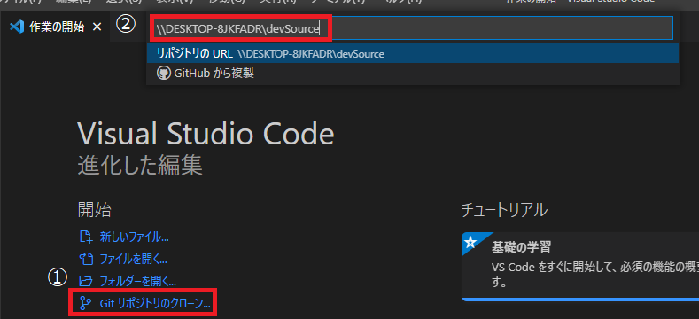
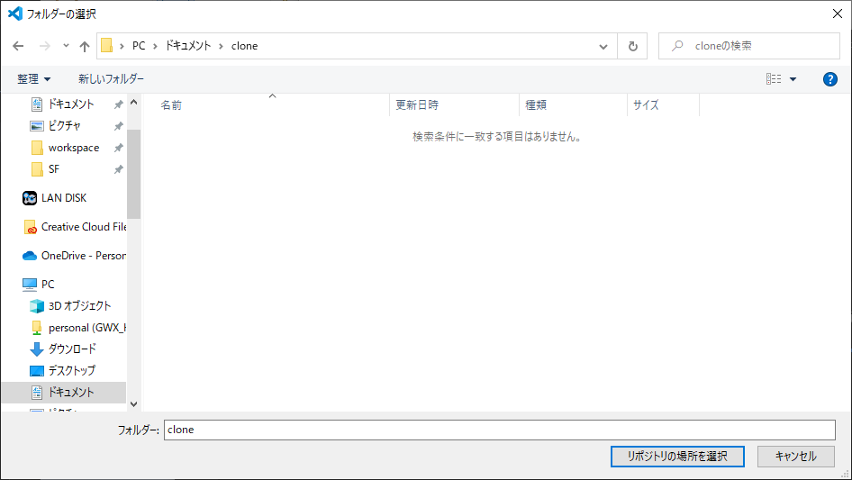
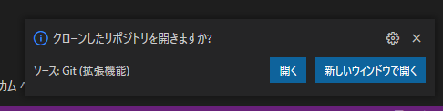
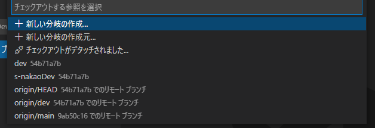
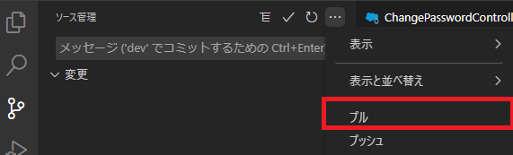
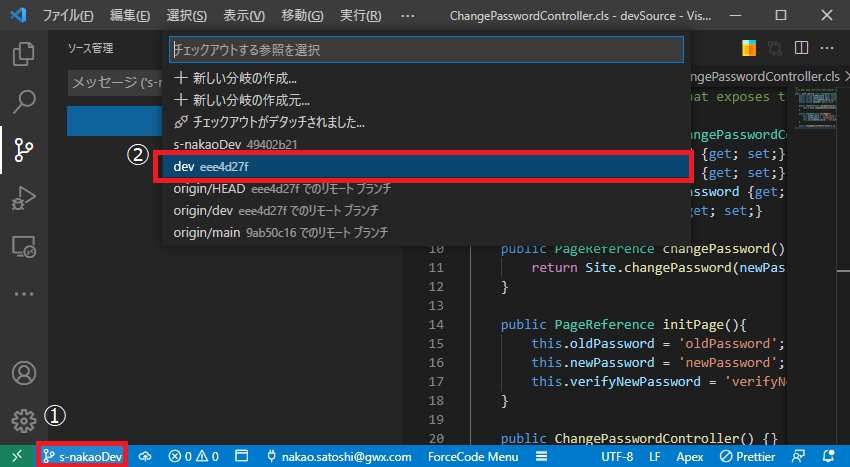
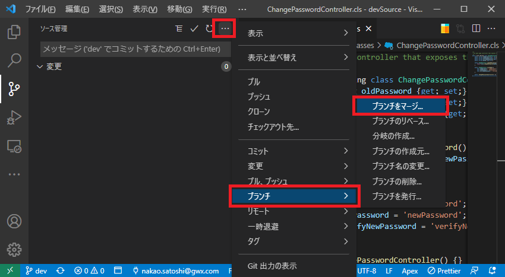
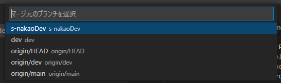
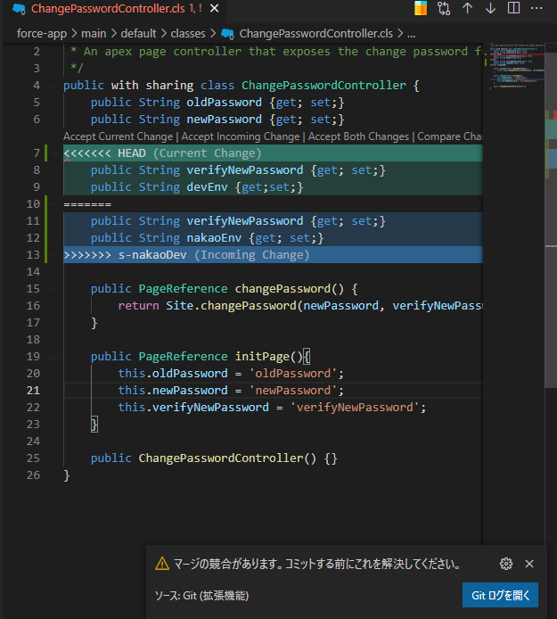
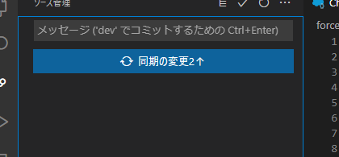

#### GitによるSF開発環境の管理

※以下はVSCodeを前提とした操作です

- 環境構築

1. ##### remote環境から環境をクローン

   1. 「リポジトリのクローン」を選択
   2. remote環境のPathを入力
      
   3. クローン先のディレクトリを指定
      
   4. クローンに成功した場合、下図のメッセージが表示される
      
   5. 「開く」をクリックして、クローンしたディレクトリ（以下、local環境）を開く

   

2. ##### local環境でdev ブランチをベースに自身のブランチを作成

   ブランチ名は[firstName_initial]-[lastName]Dev
   例）s-nakaoDev
   

   ※開発作業は上記の個人ブランチで必ず行う

   

3. ##### SFへのデプロイ手順

   ##### 前提：SF上のソースとremote環境のdev ブランチの同期が必ず取れている

   1. local環境でdev ブランチをプル
   
     

      

   2. local環境でdev ブランチに自身のブランチをマージ

      例）「s-nakaoDev」を「dev」へMerge

      1. ブランチを「dev」に切り替え
         

         

      2. 「dev」へ「s-nakaoDev」をマージ
         
         
         
         
         
         
         
      3. 競合があれば**適切に**解消し、解消内容についてもコミット
         

   3. プッシュ
   
      

      

   4. プッシュ確認後、SFへデプロイ

      

4. 
