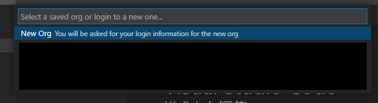
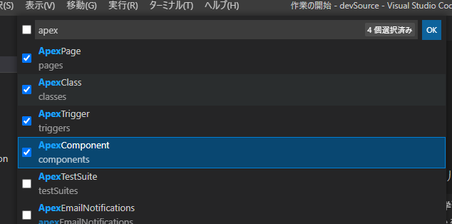
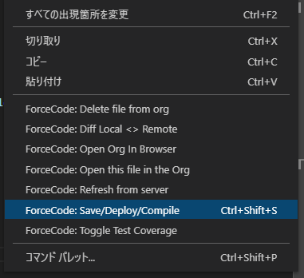

#### ForceCode導入＆マニュアル

1. ##### VSCodeの拡張機能「ForceCode」をインストール

   

   

2. ##### 開発環境ディレクトリ指定

   1. 「Ctrl+Shift+P」でコマンドメニュー表示

      「ForceCode: Create Project」を選択

      

      

   2. 開発環境ディレクトリを選択

      

      ※選択したディレクトリ直下にソースが展開される

   

3. ##### 開発環境の設定を行う

   1. 「New Org」を選択

      

      

   2. 実際の開発環境に合わせて環境の種類を選択

      

      

   3. 「No」を選択

      

      ※ファイルセーブと同時にSalesforceへのデプロイを行うか否かのオプション

      ​	デグレを防ぐため基本「No」を推奨

      

   4. 「Source」を選択

      

      

   5. 規定のブラウザでSFログイン画面が表示されるので対象の開発環境にログイン

      

      

   6. ログイン後、開発用メタデータとフォルダが開発環境ディレクトリに生成される

      

      

      

      

4. ##### ソースコード取得

   1. 「Ctrl+Shift+P」でコマンドメニュー表示

      「ForceCode: ForceCode Menu」を選択

      

      ※「Ctrl+Shift+C」で直接呼び出し可能

      

   2. 「Retrieve Package/Metadata」を選択
      

      

      

   3. 必要なソースの種類を選択

      

      

      ※VisualFoce + Apexのみの開発であれば以下がオススメ

      「Choose types」

      

      

      テキストボックスに「Apex」と入力し、以下の4種を選択して「OK」
      
      
      
      
      対象のソースが取得される
      

      

5. ##### 開発方法

   標準のSalesforce CLIと同様にソースコードをVSCode上で修正できる

   

   

   ソースデプロイ時はソース上のコンテキストメニューか「Ctrl + Shift + S」のショートカットで実行
   

   

6. VSCode上で新規VFページを定義

   1. 「Ctrl+Shift+P」でコマンドメニュー表示
      「ForceCode: ForceCode Menu」を選択

   2. 「New」を選択
      

      

   3. 「Visualforce Page」を選択
      

      

   4. 名前を指定
      

      

   5. 新規VFページの**メタデータ**が作成される
      

      ※デプロイしない限り、SF上には反映されない

      

7. VSCode上で新規VFコンポーネントを定義

   1. 6.2.までは同じ

   2. 「Visualforce Component」を選択
      

      

   3. 以降は6.4と同じ

      

8. VSCode上で新規Apexクラスを定義

   1. 6.2.までは同じ

   2. 「Class」を選択
      

      

   3. 以降は6.4と同じ

      

9. VSCode上でApexテストを実施

   1. 画面右のForceCode拡張機能アイコンをクリック
      

      

   2. 「CODE COVERGE」ペインの「Test Classes」内の実行したいテストクラスを選択
      クラス名右の「▶」をクリック
      

      

   3. 実行が正常に終了した場合、以下のメッセージが表示される
      

      

   4. カバレッジは「CODE COVERGE」ペインの「Sufficient Coverage」と「Insufficient　Coverage」から確認できる
      

      - Sufficient Coverage：カバレッジ75%以上のApexクラス
      - Insufficient Coverage：カバレッジ75%未満のApexクラス

      

   5. 通過していないステップをVSCode上から確認可能
      

      未到達ステップが塗りつぶし表示される

